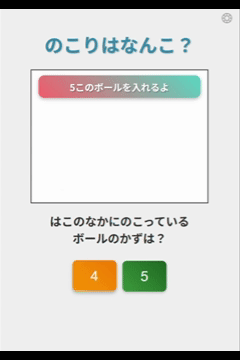

# ボールカウントゲーム

箱の中にボールが入り、数を当てる日本語学習向けゲームです。  
スタート画面、アニメーション演出、正解判定、結果画面まで実装されています。

---

## ゲーム概要

- 箱の上面の穴にボールが吸い込まれるアニメーション
- 箱の正面からボールが横に出て並ぶ演出
- プレイヤーは残っているボールの数を選択して回答
- 正解・不正解によるアニメーションとサウンド
- 結果画面でスコア表示とコメント・音声再生
- スタート画面の回転ボールアニメーション

---

## デモ画面

### スタート画面

### プレイ画面

### 結果画面

---

## 操作方法

1. スタート画面で「はじめる」をクリック
2. レベル選択画面で難易度を選択
3. ゲーム画面で残っているボールの数を選択
4. 正解・不正解後、次のラウンドへ進む
5. 全ラウンド終了後、結果画面にスコア表示

---

## 機能

- **アニメーション**
  - `animateBallsIntoBox(n, callback)` : ボールが箱に吸い込まれる
  - `animateBallsOutOfBox(n, callback)` : 箱からボールが横に並ぶ
  - `drawBall(x, y)` : ボール描画
  - `drawBox(openRight = false)` : 箱描画（上面・正面穴）
  - `shakeBox(callback)` : 箱を振動させる

- **UI**
  - 選択肢ボタン生成: `showChoices()`
  - 回答処理: `handleAnswer(answer)`
  - 結果表示: `showResult()`
  - ゲーム再開: `restartGame()`

- **サウンド・BGM**
  - 正解・不正解サウンド
  - 背景BGM切り替え
  - コメント音声再生
  - 設定画面でON/OFFと音量調整可能

- **設定メニュー**
  - 歯車アイコンでモーダル表示
  - ESCキー・モーダル外クリックで閉じる
  - ゲーム中は中断ボタン表示
  - BGM / SE / ボイスのON/OFF、音量調整

- **スタート画面アニメーション**
  - `startAnim()` / `stopStartAnim()` により回転ボールを表示

---

## 音声・画像ファイル

- 正解・不正解音声: `correct.wav`, `wrong.wav`
- 結果コメント音声: `morethan90.wav`, `90to70.wav`, `under70.wav`
- 歓声音声: `cheer.wav`
- 結果画像: `hanamaru.png`, `doublecircle.png`, `circle.png`

---

## 使用技術

- HTML / CSS / JavaScript
- Canvas API を用いた描画・アニメーション
- Audio API を用いたサウンド再生
- DOM 操作によるボタン生成とイベント制御

---

## ファイル構成例

/assets
├─ index.html
├─ start_screen.png
├─ balls_into_box.gif
├─ balls_out_of_box.gif
├─ result_screen.png
├─ hanamaru.png
├─ doublecircle.png
├─ circle.png
├─ correct.wav
├─ wrong.wav
├─ cheer.wav
├─ morethan90.wav
├─ 90to70.wav
└─ under70.wav
README.md

---

## 初期表示

ゲーム起動時はスタート画面が表示され、回転ボールアニメーションが動作します。 
初期画面だけ利用するブラウザや規約によってgbmが鳴らないことがあるのでご了承ください．
開始するとレベル選択画面へ遷移し、ゲームスタートとなります。
